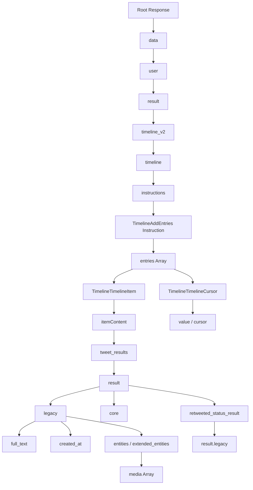

# Twitter GraphQL API & gallery-dl Output Schema Documentation

This document explains:
1. How Twitter's GraphQL API structure works under the hood.
2. How `gallery-dl` processes and flattens this complex structure.
3. The exact schema, data types, and field hierarchies found in the generated JSON archive files.

---

## 1. Under the Hood: Twitter's GraphQL API

Twitter/X utilizes a GraphQL API to retrieve timeline data. During archival, two primary GraphQL queries are made:

1. **`UserByScreenName`**: Resolves the account handle (e.g. `parodysugam`) into a unique numerical `userId` (e.g. `2055511814449102848`).
2. **`UserTweets`** (or `UserTweetsAndReplies`): Fetches the tweet timeline page-by-page.

### The GraphQL Response Structure
The raw response returned by Twitter is a deeply nested JSON document:



#### Key Elements of Raw GraphQL:
- **`instructions`**: Control commands for rendering the timeline (e.g. pinning a tweet, adding new items, or updating the pagination cursor).
- **`legacy`**: Contains the old Twitter API v1.1 fields (e.g., `full_text`, `created_at`, `favorite_count`, `retweet_count`).
- **`core`**: Contains user credentials and profile details.
- **`retweeted_status_result`**: Present only on retweets; wraps the legacy fields of the original tweet being retweeted.
- **`extended_entities.media`**: Lists video, GIF, or image URLs and resolutions.
- **`TimelineTimelineCursor`**: Contains the next cursor token, which is passed back to Twitter in the next query parameter (`&variables={"cursor":"..."}`) to request the next page.

---

## 2. gallery-dl's Processing & Flattening

Since the raw GraphQL JSON is deeply nested, `gallery-dl` flattens the records into a single outer JSON array. 

### What do the square brackets `[...]` represent?
The JSON file is a single list of elements. Inside it, **each square bracket `[...]` represents a single record emitted by `gallery-dl`, NOT necessarily a single tweet.** 

Multiple records can belong to the **same tweet** and will share the same `tweet_id` inside their metadata objects.

---

### Record Types Explained: Type 1 vs Type 2 vs Type 3

`gallery-dl` uses three token types when extracting data, represented by the first number in each square bracket:

| Record Type | Name | Description | Does it appear in our file? |
| :---: | :--- | :--- | :--- |
| **`1`** | **File Success** | Emitted when `gallery-dl` successfully downloads a media file to your hard drive. | **NO**. Since we run the script in metadata-only mode (`-j` option), it dumps text metadata without downloading physical media files. Hence, Type `1` is absent. |
| **`2`** | **Metadata** | Contains the text content, metrics (likes, retweets, views), conversation ID, source device, and author information of the tweet. | **YES**. You get exactly **one** Type `2` record for every tweet or retweet. |
| **`3`** | **Resource URL**| Contains the direct URL to a media asset (image, video, or GIF) associated with a tweet, along with its specific type, resolution, and bitrate. | **YES (Optional)**. You get Type `3` records only if a tweet has media. |

---

### Examples of How a Tweet is Structured in the JSON File:

#### Case A: A Text-Only Tweet (No Media)
It will produce exactly **one** record (one set of square brackets) of Type `2`:
1. `[ 2, { Tweet Text & Metadata } ]`

#### Case B: A Tweet with 3 Images
It will produce **four** records (four sets of square brackets) in the array, all linked by the same `tweet_id`:
1. `[ 2, { Tweet Text & Metadata } ]`
2. `[ 3, "image1_url", { Media Metadata, "num": 1 } ]`
3. `[ 3, "image2_url", { Media Metadata, "num": 2 } ]`
4. `[ 3, "image3_url", { Media Metadata, "num": 3 } ]`

#### Case C: A Retweet
It will produce exactly **one** record of Type `2`, where the `author` object is the original creator and the `user` object is the person who retweeted:
1. `[ 2, { Retweet Text & Metadata } ]`

---

## 3. Schema Hierarchy of gallery-dl Output

Here is the exact structure and field explanation for both types of records.

### A. Type `2`: Tweet & Retweet Metadata Schema

```
[
  2,
  {
    "tweet_id": 2065699189162459614,
    "category": "twitter",
    "subcategory": "tweets",
    "date": "2026-06-13 07:34:00",
    "content": "Let's find out which...",
    "favorite_count": 3,
    "retweet_count": 1,
    "reply_count": 2,
    "quote_count": 0,
    "bookmark_count": 6,
    "view_count": 6846,
    "lang": "en",
    "conversation_id": 2065699189162459614,
    "sensitive": null,
    "sensitive_flags": null,
    "source": "Twitter for iPhone",
    "source_id": 0,
    "retweet_id": 0,
    "date_original": "2026-06-13 07:34:00",
    "author": { ... },
    "user": { ... }
  }
]
```

#### Hierarchical Field Directory:

| Field Path | Data Type | Description |
| :--- | :--- | :--- |
| **`tweet_id`** | `Long` | The unique numerical ID of this tweet. |
| **`category`** | `String` | Constant value `"twitter"`. |
| **`subcategory`** | `String` | Timeline category (usually `"tweets"` or `"replies"`). |
| **`date`** | `String` | Timestamp when the tweet action appeared on the timeline (`YYYY-MM-DD HH:MM:SS`). |
| **`date_original`** | `String` | Timestamp of the original tweet creation. For normal tweets, matches `date`. For retweets, this is the date the original author tweeted it. |
| **`content`** | `String` | The raw text content of the tweet. For retweets, prefixed with `RT @handle: `. |
| **`favorite_count`** | `Integer` | Number of likes the tweet received. |
| **`retweet_count`** | `Integer` | Number of retweets. |
| **`reply_count`** | `Integer` | Number of comments/replies. |
| **`quote_count`** | `Integer` | Number of quote tweets. |
| **`bookmark_count`**| `Integer` | Number of times users bookmarked the tweet. |
| **`view_count`** | `Integer` | Number of times the tweet was viewed (impression count). |
| **`lang`** | `String` | BCP 47 language code detected by Twitter (e.g., `"en"`). |
| **`conversation_id`**| `Long` | ID of the root tweet in the thread. Used to reconstruct reply chains. |
| **`sensitive`** | `Boolean` | `true` if marked as sensitive content, `false` or `null` otherwise. |
| **`sensitive_flags`**| `Array` | Details on sensitivity restrictions (e.g. `["Nudity", "Sensitive"]`). |
| **`source`** | `String` | Client application used to publish the tweet (e.g., `"Twitter for iPhone"`). |
| **`retweet_id`** | `Long` | If this is a Retweet, contains the original `tweet_id`. If it is a normal tweet, this is `0`. |
| **`author`** | `Object` | The user profile that wrote the **original** content. (See User Schema below). |
| **`user`** | `Object` | The owner of the timeline being scraped (e.g. the retweeter). |

---

### B. Type `3`: Media Download URL Schema

For tweets containing media (images, videos, or GIFs), `gallery-dl` outputs type `3` items. Each file is generated as a separate array entry:

```
[
  3,
  "https://video.twimg.com/ext_tw_video/.../vid/720x960/pXfqASGL.mp4",
  {
    "tweet_id": 2066700339974156519,
    "type": "video",
    "extension": "mp4",
    "filename": "pXfqASGL1Y4X7s9O",
    "width": 720,
    "height": 960,
    "duration": 59.666,
    "bitrate": 2176000,
    "num": 1,
    "content": "ur m0m seducing...",
    "author": { ... },
    "user": { ... }
  }
]
```

#### Hierarchical Field Directory:

| Field Path | Data Type | Description |
| :--- | :--- | :--- |
| **`Index 0`** | `Integer` | Record Identifier `3` (Media link). |
| **`Index 1`** | `String` | Direct HTTP URL of the source media file on Twitter CDNs. |
| **`Index 2` (Metadata)**| `Object` | Metadata context containing all fields from Type 2, plus: |
| ↳ **`type`** | `String` | Media type classification (`"image"`, `"video"`, or `"animated_gif"`). |
| ↳ **`extension`** | `String` | File format suffix (`"jpg"`, `"png"`, `"mp4"`). |
| ↳ **`filename`** | `String` | Base filename chosen by gallery-dl (usually the unique hash of the Twitter asset). |
| ↳ **`width`** | `Integer` | Media width resolution in pixels. |
| ↳ **`height`** | `Integer` | Media height resolution in pixels. |
| ↳ **`duration`** | `Double` | Duration of the video/GIF in seconds (video only). |
| ↳ **`bitrate`** | `Integer` | Stream bitrate of the video/GIF (video only). |
| ↳ **`num`** | `Integer` | Index of the media file inside the tweet (e.g. if a tweet has 4 images, `num` ranges 1-4). |

---

### C. User Profile Sub-Schema (`author` and `user` Objects)

Both Type 2 and Type 3 items contain user objects detailing the accounts involved:

```json
{
  "id": 2055511814449102848,
  "name": "parodysugam",
  "nick": "goonaddict",
  "location": "",
  "description": "love all k1nks ...",
  "followers_count": 2439,
  "friends_count": 447,
  "listed_count": 1,
  "favourites_count": 778,
  "media_count": 175,
  "statuses_count": 281,
  "profile_image": "https://pbs.twimg.com/profile_images/...",
  "profile_banner": "https://pbs.twimg.com/profile_banners/...",
  "protected": false,
  "verified": false,
  "date": "2026-05-16 04:54:18"
}
```

#### Hierarchical Field Directory:

| Field Path | Data Type | Description |
| :--- | :--- | :--- |
| **`id`** | `Long` | Unique numerical Twitter user ID. |
| **`name`** | `String` | Account screen handle (used in URL: `@parodysugam`). |
| **`nick`** | `String` | Display Name (e.g. `goonaddict`). |
| **`description`** | `String` | User Biography (Bio text). |
| **`location`** | `String` | Location string provided in profile. |
| **`followers_count`** | `Integer` | Total accounts following this user. |
| **`friends_count`** | `Integer` | Total accounts this user follows (Following). |
| **`favourites_count`**| `Integer` | Total tweets this user liked. |
| **`statuses_count`** | `Integer` | Total posts published by this user. |
| **`media_count`** | `Integer` | Total images/videos uploaded by this user. |
| **`profile_image`** | `String` | URL of the profile picture. |
| **`profile_banner`** | `String` | URL of the profile banner picture. |
| **`protected`** | `Boolean` | `true` if account is private (requires follow approval). |
| **`verified`** | `Boolean` | `true` if account has blue checkmark / premium. |
| **`date`** | `String` | Date when the user account was created (`YYYY-MM-DD HH:MM:SS`). |
